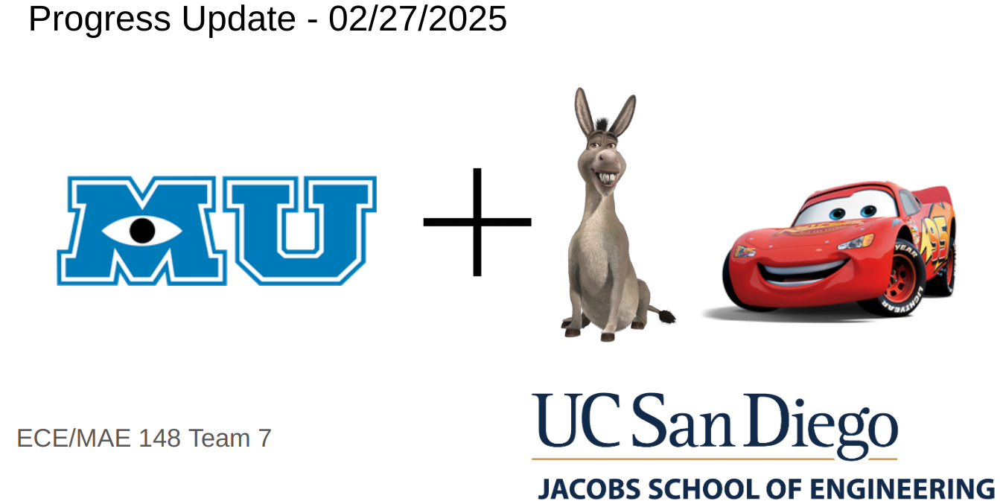

# <div align="center">IMU Integration Donkeycar Framework</div>

### <div align="center"> MAE 148 Final Project </div>
#### <div align="center"> Team 7 Winter 2025 </div>

<div align="center">
     
</div>

## Table of Contents
  <ol>
    <li><a href="#team-members">Team Members</a></li>
    <li><a href="#abstract">Abstract</a></li>
    <li><a href="#what-we-promised">What We Promised</a></li>
    <li><a href="#accomplishments">Accomplishments</a></li>
    <li><a href="#challenges">Challenges</a></li>
    <li><a href="#future-work">Future Work</a></li>  
    <li><a href="#final-project-videos">Final Project Videos</a></li>
    <li><a href="#software">Software</a></li>
    <li><a href="#hardware">Hardware</a></li>
    <li><a href="#course-deliverables">Course Deliverables</a></li>
    <li><a href="#project-reproduction">Project Reproduction</a></li>
    <li><a href="#acknowledgements">Acknowledgements</a></li>
    <li><a href="#contacts">Contacts</a></li>
  </ol>

<hr>

## Team Members
Brandon Lopez - MAE  - Class of 2025 - [LinkedIn](https://www.linkedin.com/in/brandon26/) 

Francisco Garcia - ECE - Class of 2025 - [LinkedIn](https://www.linkedin.com/in/francisco-garcia-351270219/) 

Atharva Kedia - ECE - Class of 2026 - [LinkedIn](https://www.linkedin.com/in/atharvakedia/)

Bree Stram - BENG - Class of 2025 - [LinkedIn](https://www.linkedin.com/in/breanna-stram-30389b2a6/)


<hr>

## Abstract
This project enhances the DonkeyCar autonomous driving framework by integrating Inertial Measurement Unit (IMU) data with GPS for more accurate path tracking. This is needed because the IMU measures in a relative frame and is subject to integration drift, giving us innacurate euler angle readings overtime (i.e. heading readings for positioning of the robocar). The GPS also operates at a low frequency with low accuracy. However, to improve localization, we can integrate both GPS and IMU sensors and perform sensor fusion algorithms that allow us to implement path tracking and navigation at a higher frequency and a higher accuracy. This project modifies the existing complete.py template and imu.py file to incorporate IMU data (euler angles, acceleration, and gyroscope readings), by utilizing the Madwick Quaternion Update algorithm. This sensor fusion algorithm, coupled with the GPS, allows for more precise position estimation.
The modifications involve:

*    Updating myconfig.py to toggle IMU part intialization in DonkeyCar vehicle pipeline.
*    Calibrating and smoothing out the IMU data readings in imu.py.
*    Visualizing real-time IMU data for debugging and optimization.
*    Developing a fusion algorithm that combines GPS and IMU data to enhance path accuracy.

The result is a more robust framework, capable of handling GPS inaccuracies by leveraging IMU-based dead reckoning, improving path-following performance in autonomous driving applications.

<div align="center">
     
</div>

<hr>

## What We Promised
### Must Have
*    Integrate GPS and IMU sensors into the DonkeyCar framework.
*    Modify the existing path recording system to log both GPS and IMU data for enhanced localization.
*    Implement a sensor fusion algorithm (e.g., Extended Kalman Filter or Madwick Quaternion Update) to improve path accuracy using IMU and GPS.
*    Ensure the DonkeyCar can record and follow an autonomous path with improved precision.

### Nice to Have
*    Develop a real-time visualization tool to display IMU-GPS sensor data for debugging and optimization.
*    Implement basic drift correction using IMU data when GPS signal quality is low.
*    Extend the system to allow for future integration with additional sensors (e.g., LiDAR, depth cameras) for enhanced mapping and navigation.
<hr>

## Accomplishments
* Sparkfun Artemis OpenLog IMU Integration
  * Complete OOP abstraction of Sparkfun IMU into existing framework for simple utilization in Jetson Nano
  * Smoothen Gyroscope data using Kalman Filter
  * Linearize accelerometer to Earth's frame
  * Magnetometer calibration compatability
  * Madwick Quaternion Update to get accurate euler angle readings of the IMU sensors
* Fused GPS + IMU sensors using Extended Kalman Filter to update and predict more reliable positioning (still have to test and prove it works)
<hr>

## Challenges
* Establishing I2C communication between the BNO085 IMU and the Jetson Nano was difficult due to permission conflicts and dependency issues, requiring extensive troubleshooting.
* Integrating the IMU with the DonkeyCar Framework proved challenging because the existing codebase was fragmented. We struggled to determine the correct approach for adding a new component to log data and utilize it in real-time processing within the framework.
* We aimed to fuse GPS data with the IMU to improve path accuracy, but implementing sensor fusion was complex due to synchronization issues and the need for an effective filtering method, such as a Extended Kalman Filter.
<hr>

## Future Work
* Debug the I2C communication for the BNO085 IMU and test with the existing codebase.
* Optimize IMU code for multithreading specifically for the Jetson Nano.
* Implement the logic to rely on the IMU whenever the GPS is not functioning properly.
* Implement path following using the GPS + IMU sensor fusion.
* Test and prove that out sensor fusion works properly with the existing codebase.
<hr>

## Final Project Videos
**Click** any of the images below to **reroute to the video**. 
<div align="center">
     
#### **IMU Data Reading**

[](https://youtu.be/060TtfnaJ5Q)

#### **IMU Real Time Data Plotting**

[](https://youtu.be/KJVEJFGC0Ec)
</div>

<hr>

## Software

### Overall Architecture
The project was integrated into a fork of the original DonkeyCar framework, which can be found [here](https://github.com/FrancGarcia/donkeycar). The adaptation allowed for seamless integration and deployment of the required IMU abstraction, facilitating efficient sensor fusion with the existing GPS module within the framework.


<hr>

## Hardware 

* __3D Printing:__ Camera Stand, Jetson Nano Case, GPS Plate, Lidar Mount
* __Laser Cut:__ Base plate to mount electronics and other components.

__Parts List__

* Traxxas Chassis with steering servo and sensored brushless DC motor
* Jetson Nano
* WiFi adapter
* 64 GB Micro SD Card
* Adapter/reader for Micro SD Card
* Logitech F710 controller
* OAK-D Lite Camera
* LD19 Lidar (LD06 Lidar)
* VESC
* Point One GNSS with antenna
* Anti-spark switch with power switch
* DC-DC Converter
* 4-cell LiPo battery
* Battery voltage checker/alarm
* DC Barrel Connector
* XT60, XT30, MR60 connectors
* SparkFun OpenLog Artemis (DEV-16832)

*Additional Parts used for testing/debugging*

* Car stand
* USB-C to USB-A cable
* Micro USB to USB cable
* 5V, 4A power supply for Jetson Nano

### __Mechanical Design Highlight__

__Base Plate__
<div align="center">
 
</div>

__Camera Stand__

Camera Stand components were designed in a way that it's an adjustable angle and height This design feature offers versatility and adaptability, ensuring optimal positioning of the camera to capture desired perspectives and accommodate various environments or setups.

<div align="center">

</div>

__GPS Plate__
<div align="center">

</div>

__Circuit Diagram__

Our team made use of a select range of electronic components, primarily focusing on the OAK-D Lite camera, Jetson NANO, a GNSS board / GPS, and an additional SparkFun OpenLog Artemis (DEV-16832) for IMU recording.
<div align="center">

</div>
<hr>

## Course Deliverables
Here are our autonomous laps as part of our class deliverables:

* DonkeySimulator Autonomous Laps: https://youtu.be/k4IBv1xpOJo
* DonkeySimulator Autonomous (Remote Server) Laps: https://youtu.be/6-3juWUL2Wc
* Lane Following Autonomous Laps: https://youtu.be/3gb0JS8ZidY
* GPS Autonomous Laps: https://youtu.be/-sfzaUusQJ4
* OpenCV Autonomous Laps: https://youtu.be/kRCSMZZy2x0

Weekly Project Status Update and Final Presentation:  
* [Google Slides](https://docs.google.com/presentation/d/1NeJFdNSlSz2XIg3V0_UelSlysrG5QyMZ0-aBoINpIxE/edit#slide=id.g335b997d1d9_0_5)
[](https://docs.google.com/presentation/d/1NeJFdNSlSz2XIg3V0_UelSlysrG5QyMZ0-aBoINpIxE/edit#slide=id.g335b997d1d9_0_5)
<hr>

## Project Reproduction
If you are interested in reproducing our project, here are a few steps to get you started:
* Jetson Nano Configuration [Link](https://docs.google.com/document/d/1TF1uGAFeDARNwbPkgg9xg4NvWPJvrsHW2I_IN9dWQH0/edit?tab=t.0#heading=h.b0ghgbcoid6m)
* Jetson Xavier Configuration [Link](https://docs.google.com/document/d/1mXgN9DcAj30HAsbfrHNCP-YEYqKWPTbcUssRI1Xab1A/edit?tab=t.0#heading=h.qfnzubgcn5p6)
* OpenCV CUDA Accelerated [Link](https://docs.google.com/document/d/1HX2zmjbVsyLnliEQ8wp97Y453g5qNAYHWtFQiKQ0elA/edit?tab=t.0#heading=h.uieq3bo7w218)
* UCSD Robocar Framework [Link](https://docs.google.com/document/d/1Onft0sIWhEd9UH7fItJ0atC1hKnxpTxKKmUFHtqC-sA/edit?tab=t.0)

Follow instruciton on UCSD Robocar Framework [Link](https://docs.google.com/document/d/1Onft0sIWhEd9UH7fItJ0atC1hKnxpTxKKmUFHtqC-sA/edit?tab=t.0) pull `devel` image on your Jetson Nano:
```
docker pull djnighti/ucsd_robocar:devel
```
```
sudo apt update
```
```
sudo apt upgrade
```


## Acknowledgements
Special thanks to [Professor Jack Silberman](https://www.linkedin.com/in/jacksilberman/) and both TA's, [Winston](https://www.linkedin.com/in/winston-wei-han-chou-a02214249/) and [Alexander](https://www.linkedin.com/in/alexanderhaken/), for delivering the course!  
Thanks to [Aryan](https://www.linkedin.com/in/aryan-palaskar-309b10176/) on Triton AI for giving suggestions and supporting our project!  

**Programs Reference:**
* [UCSD Robocar Framework](https://gitlab.com/ucsd_robocar2)

README.md Format, reference to [winter-2024-final-project-team-7](https://github.com/UCSD-ECEMAE-148/winter-2024-final-project-team-7)

<hr>

## Contacts

* Francisco Garcia - frgarcia@ucsd.edu | frgarciaa1@gmail.com | [LinkedIn](https://www.linkedin.com/in/francisco-garcia-351270219/)
* Brandon Lopez - blopez@ucsd.edu | brandon.lopez.miramontes@gmail.com | [LinkedIn](https://www.linkedin.com/in/brandon26/) 
* Atharva Kedia - atkedia@ucsd.edu | [LinkedIn](https://www.linkedin.com/in/atharvakedia/)
* Bree Stram - bstram@ucsd.edu | [LinkedIn](https://www.linkedin.com/in/breanna-stram-30389b2a6/)

<hr>
